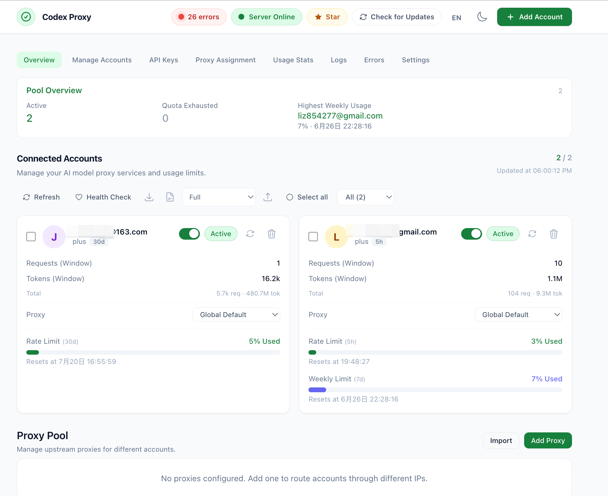
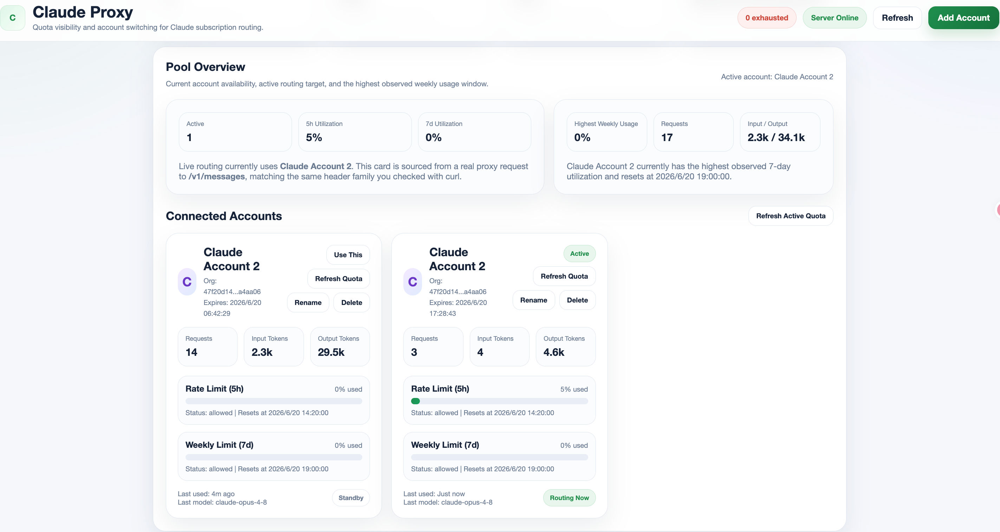

# AI Gateway OpenSource Bundle

[English](./README.md) | 简体中文

这是一个把 **Claude 代理**、**Codex 代理** 和 **统一状态 API** 收口在一起的开源整理版目录。

目标不是重新发明两个代理，而是把“**一个可用的 AI 网关平台**”打包清楚，让别人拿到目录后能快速理解：

- 这个平台能做什么
- 为什么 Claude / Codex 会员能力能被程序化调用
- 多账号、额度、状态是怎么管理的
- 怎么安装、启动、查看效果

## 1. 这是什么

这个目录是一个聚合仓库，里面包含三部分：

1. `claude-code-proxy`
   把 Claude 网页 / Claude Code 的登录态包装成可调用的 Anthropic `messages` 代理，并带一个轻量管理看板。

2. `codex-proxy`
   把 Codex Desktop / ChatGPT 的能力包装成 OpenAI / Anthropic / Gemini / Codex 多协议代理，并支持多账号池、轮转和 quota 管理。

3. `ai-token-status-api.js`
   一个统一状态接口，把 Claude 和 Codex 当前的账号、可用性、token 状态、额度窗口统一封装成可调用的 JSON API。

## 2. 它能解决什么问题

简单说，这个平台把“账号散落、额度不透明、状态不好查、前端调用不统一”这几个问题收口了。

你可以把它理解成一个本地或私有部署的 AI 网关层：

- 对业务方：
  只需要记住统一入口，不需要知道底层账号怎么登录、怎么续期、怎么轮转。

- 对运维方：
  能看到当前哪个账号可用、额度还剩多少、token 什么时候过期、为什么现在不能用。

- 对接入方：
  Claude、Codex、状态中心都可以通过 HTTP 调用，不需要登录桌面客户端界面才能知道当前情况。

## 3. 目录结构

```text
opensource/
├── readme.md
├── ai-token-status-api.js
├── aa.sh
├── pngs/
│   ├── claude-proxy.png
│   └── codex-proxy.png
├── claude-code-proxy/
└── codex-proxy/
```

说明：

- `claude-code-proxy/`
  是整理后的 Claude 代理源码，包含我补的 Dashboard、多账号状态持久化和状态接口联动能力。

- `codex-proxy/`
  是整理后的 Codex 代理源码，负责账号池、协议转换、模型路由和限额缓存。

- `ai-token-status-api.js`
  是这个聚合包新增的统一状态服务。

- `aa.sh`
  是顶层的简化运维脚本。

## 4. 效果图

### Claude / 平台状态视图



### Codex 多账号池与额度看板



## 5. 核心功能

### 5.1 Claude 代理能力

- OAuth 登录 Claude，不依赖官方 API Key
- 兼容 Anthropic `POST /v1/messages`
- 支持管理看板 `/dashboard`
- 支持本地多账号存储，但只有一个 `active` 账号参与实际路由
- 可视化展示：
  - 5 小时窗口
  - 7 天窗口
  - token 过期时间
  - 本地累计 token 使用量

### 5.2 Codex 代理能力

- 支持多账号池
- 支持 OpenAI / Anthropic / Gemini / Codex 多协议
- 支持按账号 plan 自动路由
- 支持 quota 缓存、健康检查、状态衍生
- 支持多账号轮转：
  - 最少使用优先
  - 轮询
  - 粘性

### 5.3 统一状态 API

- 一个接口同时看 Claude 和 Codex
- 统一输出：
  - 服务是否可达
  - 当前是否认证
  - 账号是否可用
  - token 什么时候过期
  - 额度何时重置
  - 当前为什么不可用

## 6. 工作原理

### 6.1 最重要的一点

这套平台**不是在生成官方开发者 API Key**。

它做的事情是：

- 拿到官方网页或官方客户端自己的登录态
- 复用官方客户端本来就在访问的后端接口
- 再把它包装成业务方更熟悉的 API 格式

所以它的本质是：

**把会员账号原本通过官方客户端可访问的推理通道，转换成一个本地可编程网关。**

### 6.2 Claude 为什么能“像 API 一样调用”

Claude 这条链路本质是：

1. 浏览器 OAuth 登录 Claude
2. 本地保存 `access_token` / `refresh_token`
3. 用 Bearer token 直接请求：

```text
https://api.anthropic.com/v1/messages
```

4. 再把结果回传给调用方

也就是说：

- 不是生成 Anthropic 官方 Console API Key
- 而是复用 Claude 网页 / Claude Code 自己的认证与请求链路

### 6.3 Codex 为什么能“像 API 一样调用”

Codex 这条链路本质是：

1. 通过 OpenAI / ChatGPT 登录态拿到 token
2. 调用 Codex Desktop 实际使用的后端接口：

```text
https://chatgpt.com/backend-api/codex/responses
```

3. 再把它翻译成：
   - OpenAI Chat Completions
   - Anthropic Messages
   - Gemini
   - Codex Responses

所以它也不是在“制造新权限”，而是在**包装官方客户端已有能力**。

## 7. 和官方开发者 API 的区别

这点很重要。

### 它能做的

- 用会员账号已有的模型访问能力发推理请求
- 用会员账号对应的限额窗口运行
- 以更标准的接口暴露给脚本或业务服务

### 它不能做的

- 不等于官方开发者平台 API Key
- 不会绕开账号 plan 本来的模型权限
- 不会绕开 5h / 7d / quota / rate limit
- 不能天然查询消费者订阅的真实账单续费日

## 8. 端口约定

推荐使用下面这组端口：

- Claude 代理：`42069`
- Codex 代理：`8080`
- 状态 API：`42124`

## 9. 安装前准备

建议环境：

- Linux / macOS
- Node.js 20+
- npm

额外依赖：

- `codex-proxy` 源码运行时建议准备 Rust 工具链（其 native TLS 组件会用到）

账号准备：

- Claude 路径：Claude Pro / Max 或可用的 Claude 登录态
- Codex 路径：ChatGPT / Codex 可用账号

## 10. 安装步骤

### 10.1 Claude 代理

```bash
cd /path/to/opensource/claude-code-proxy
npm install
```

启动：

```bash
npm start
```

首次使用：

```text
http://localhost:42069/auth/login
```

### 10.2 Codex 代理

最简单的理解方式是：`codex-proxy` 是一个独立项目，这里是把它收进来了。

源码运行方式：

```bash
cd /path/to/opensource/codex-proxy
npm install
cd web && npm install && cd ..
```

如果你需要 native TLS 组件：

```bash
cd native
npm install
npm run build
cd ..
```

启动开发模式：

```bash
npm run dev
```

或构建后运行：

```bash
npm run build
npm start
```

访问：

```text
http://localhost:8080
```

### 10.3 统一状态 API

这个文件不依赖框架，直接用 Node 启动即可：

```bash
cd /path/to/opensource
node ai-token-status-api.js
```

默认监听：

```text
http://127.0.0.1:42124
```

可选环境变量：

```bash
AI_STATUS_PORT=42124
AI_STATUS_HOST=127.0.0.1
CLAUDE_STATUS_BASE_URL=http://127.0.0.1:42069
CODEX_STATUS_BASE_URL=http://127.0.0.1:8080
AI_STATUS_TIMEOUT_MS=8000
```

## 11. 最小可运行组合

如果你只想最小验证这套平台，建议顺序：

1. 启动 `codex-proxy`
2. 启动 `claude-code-proxy`
3. 启动 `ai-token-status-api.js`

然后检查：

```bash
curl http://127.0.0.1:42069/auth/status
curl http://127.0.0.1:8080/auth/status
curl http://127.0.0.1:42124/health
curl http://127.0.0.1:42124/api/status
```

## 12. 如何使用

### 12.1 调 Claude

```bash
curl http://127.0.0.1:42069/v1/messages \
  -H "Content-Type: application/json" \
  -d '{
    "model": "claude-sonnet-4-5",
    "max_tokens": 32,
    "messages": [
      {"role": "user", "content": "Reply with exactly: ok"}
    ]
  }'
```

### 12.2 调 Codex

```bash
curl http://127.0.0.1:8080/v1/chat/completions \
  -H "Content-Type: application/json" \
  -H "Authorization: Bearer your-proxy-api-key" \
  -d '{
    "model": "gpt-5.4",
    "messages": [
      {"role": "user", "content": "Hello"}
    ]
  }'
```

### 12.3 查统一状态

```bash
curl http://127.0.0.1:42124/api/status
curl http://127.0.0.1:42124/api/status/claude
curl http://127.0.0.1:42124/api/status/codex
curl "http://127.0.0.1:42124/api/status?refresh=1"
```

## 13. 多账号场景怎么理解

### Claude

- 支持多账号存储
- 但同一时间只有一个 `active` 账号参与请求
- 所以状态判断主要看：
  - `active_account_id`
  - active 账号的 `usable`
  - `refresh_ok`

### Codex

- 是真正的账号池
- 多个账号可能同时 `usable=true`
- 返回时不会替你合并成一个平均值
- 外部调用方应该自己决定选哪个账号

推荐筛选逻辑：

1. 先过滤 `usable=true`
2. 再按 `rate_limit.used_percent` 升序
3. 再按 `expires_at` 降序

## 14. 状态 API 里最容易误解的字段

请特别注意：

- Claude 的 `token_expires_at`
  不是 Claude Pro / Max 订阅到期日
- Codex 的 `expires_at`
  不是 ChatGPT Plus / Pro 会员到期日

它们都只是：

**当前认证 token 的过期时间**

这意味着：

- token 到期了，服务不一定立刻不能用
- 如果 refresh 正常，仍然可能继续使用
- 只有 refresh 也失败时，才会真正不可用

## 15. 顶层运维脚本

顶层 [aa.sh](./aa.sh) 提供了一个轻量的本地运维入口。

可用命令：

```bash
./aa.sh ports
./aa.sh start-claude
./aa.sh stop-claude
./aa.sh start-status
./aa.sh stop-status
./aa.sh health
./aa.sh logs
```

说明：

- 这个脚本主要用于启动 / 停止 Claude 代理和状态 API
- `codex-proxy` 由于本身启动形态更复杂，建议直接进入子项目按其 README 操作

## 16. 截图怎么看

`pngs/` 里的效果图建议这样理解：

- `claude-proxy.png`
  重点看 Claude 账号、限额窗口、Dashboard 操作路径

- `codex-proxy.png`
  重点看多账号池、每个账号的 rate limit、weekly limit、proxy assignment 能力

## 17. 已知边界

- Claude 无法可靠查到消费者订阅的真实续费日
- Codex / ChatGPT Plus 也无法通过这套状态 API 可靠查到会员真实续费日
- 这套平台依赖官方客户端或网页当前可用的认证链路
- 一旦 token 失效、refresh token 被撤销、上游风控调整，平台能力也会受影响

## 18. 授权与来源说明

这个目录不是“从零写的两个全新代理”，而是一个**聚合整理版**。

其中：

- `claude-code-proxy/`
  基于上游项目继续整理和增强，当前 `package.json` 标记为 `MIT`

- `codex-proxy/`
  来自独立上游项目；其 README 中已明确标注 `Non-Commercial` 许可取向

因此你在对外开源、分发或商用之前，必须分别检查并遵守各上游项目自己的许可证、声明和使用限制。

建议在正式公开仓库时保留：

- 原始 README
- 原始 package 信息
- 原始 LICENSE / 声明文件
- 你的二次整理说明

## 19. 一句话总结

这个目录可以把它看成：

**一个把 Claude、Codex 和状态中心打包到一起的 AI 网关平台源码包。**

它最大的价值不是“接通一个模型”，而是：

**让多个会员账号、多种协议、额度状态和运维动作都进入统一管理面。**
